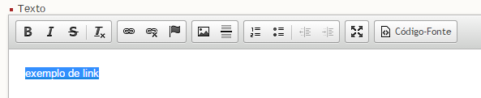
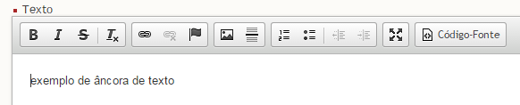
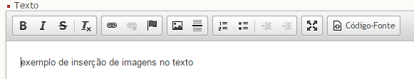
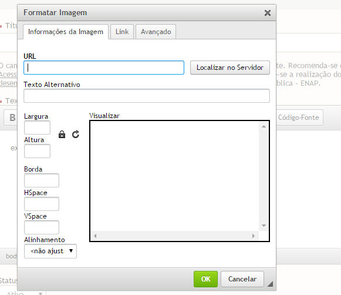
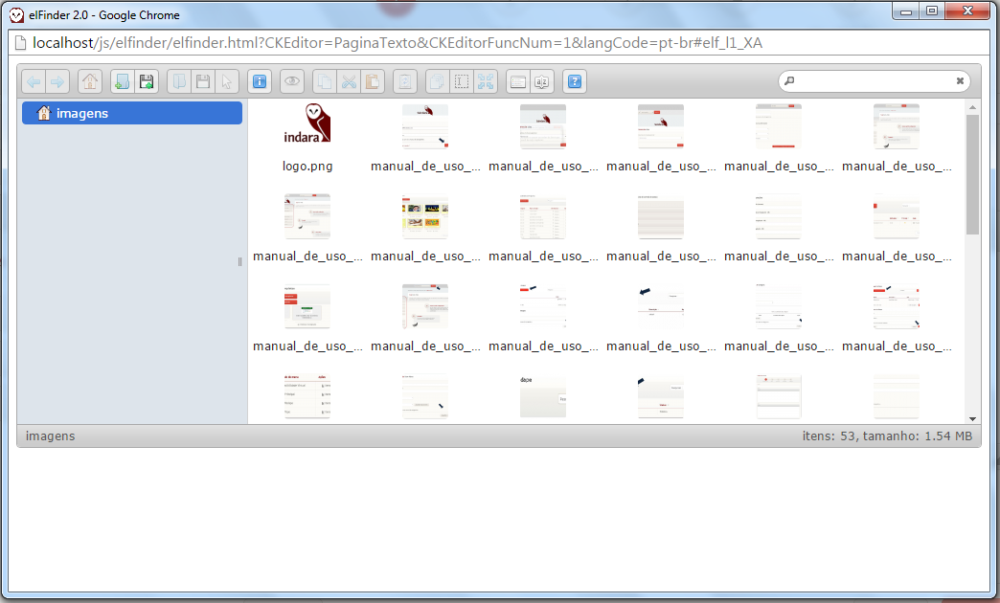
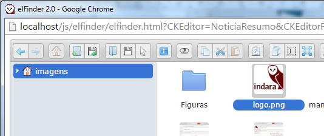

# Para editores

**Versão com editor ampliado**

Editor Ampliado
==========================================

O presente manual se refere à versão do Suindara com editor ampliado. As novas funcionalidades incluídas no editor contém funções que podem comprometer a acessibilidade do site. Recomenda-se que as orientações do Modelo de Acessibilidade em [Governo Eletrônico - eMAG](http://emag.governoeletronico.gov.br/) sejam seguidas. Além disso, sugere-se a realização dos cursos de acessibilidade para [desenvolvedor](http://www.enap.gov.br/web/pt-br/sobre-curso?p_p_id=enapvisualizardetalhescurso_WAR_enapinformacoescursosportlet&p_p_lifecycle=0&p_p_state=normal&p_p_mode=view&p_r_p_564233524_idCurso=2617) e [conteudista](http://www.enap.gov.br/web/pt-br/sobre-curso?p_p_id=enapvisualizardetalhescurso_WAR_enapinformacoescursosportlet&p_p_lifecycle=0&p_p_state=normal&p_p_mode=view&p_r_p_564233524_idCurso=2616) oferecidos pela Escola Nacional de Administração Pública – ENAP.

Texto Tachado
---------------------------------------

Clique sobre o botão “Tachado” e em seguida digite o texto desejado, conforme figura 2.

Remover Formatação
--------------------------------------------

Selecione o texto desejado e em seguida clique sobre o botão “Remover Formatação”, conforme figura 3.

Inserir/Editar Link
---------------------------------------------

Selecione o texto desejado e em seguida clique sobre o botão “Inserir/Editar Link”, conforme figura 4.

Em seguida, preencha o campo “URL” e clique sobre o botão “ok”, conforme figura 5.

Remover Link
--------------------------------------

Selecione o link desejado e em seguida clique sobre o botão “Remover Link”, conforme figura 6.

Inserir/Editar Âncora
-----------------------------------------------

Posicione o cursor no ponto do texto no qual deseja inserir uma âncora e em seguida clique sobre o botão “Inserir/Editar Âncora”, conforme figura 7.

A âncora adicionada é representada pela bandeira vermelha no texto, conforme figura 8.

Inserir/Editar Link para Âncora
---------------------------------------------------------

Selecione o texto desejado e em seguida clique sobre o botão “Inserir/Editar Link”, conforme figura 9.

Em seguida selecione na caixa de seleção “Tipo de hiperlink”, opção “Âncora nesta página”. Selecione o “nome da âncora” e o “Id da âncora” desejados e em seguida clique no botão “ok”, conforme figura 10.

Inserir Imagem
----------------------------------------

Selecione o ponto desejado no texto para inserção de imagem e em seguida clique sobre o botão “Imagem”, conforme figura 11.

Em seguida a seguinte tela será exibida. Informe a URL da imagem ou clique sobre o botão “Localizar no Servidor” para abrir o banco de imagens, conforme figura 12.

A seguir, tela com as imagens disponíveis no servidor onde o suindara foi hospedado é exibida, conforme figura 13.

Clique duas vezes sobre a figura desejada para adicioná-la, conforme figura 14.

Em seguida preencha o texto alternativo da imagem e clique sobre o botão “ok”, conforme a figura 15.

Após clicar no botão “ok” a imagem é inserida no texto, conforme figura 16.

Banco de Imagens do Editor
----------------------------------------------------

Criar Pasta
--------------------------------------

Clique sobre o ícone para criar uma nova pasta, conforme figura 18.

Pasta de exemplo criada, conforme figura 19.

Excluir Pasta
----------------------------------------

Clique com o botão direito sobre a pasta e em seguida sobre a opção “Deletar”, conforme figura 20.

Upload de Imagem para o Banco de Imagens do Editor
-----------------------------------------------------------------------------

Clique sobre o ícone para realizar o upload de nova imagem, conforme figura 21.

Download de Imagem do Banco de Imagens do Editor
---------------------------------------------------------------------------

Selecione a imagem que deseja realizar o download e em seguida clique sobre o ícone, conforme figura 22.

Funcionalidades e opções relacionadas à imagens
--------------------------------------------------------------------------

Selecione a imagem que deseja realizar o download e em seguida clique sobre o ícone, conforme figura 23.

Inserir Linha Horizontal
---------------------------------------------------

Selecione o ponto desejado no texto para inserção da linha horizontal e em seguida clique sobre o botão “Inserir Linha Horizontal”, conforme figura 24.

Linha inserida no texto, conforme figura 25.

Inserir Lista Numerada
-------------------------------------------------

Selecione o ponto desejado no texto para inserção de lista numerada e em seguida clique sobre o botão “Lista Numerada”, conforme figura 26.

Inserir Lista sem Números
----------------------------------------------------

Selecione o ponto desejado no texto para inserção de lista sem números e em seguida clique sobre o botão “Lista sem números”, conforme figura 27.

Diminuir Recuo
-----------------------------------------

Selecione o ponto desejado no texto para diminuir o recuo e em seguida clique sobre o botão “Diminuir Recuo”, conforme figura 28.

Aumentar Recuo
-----------------------------------------

Selecione o ponto desejado no texto para aumentar o recuo e em seguida clique sobre o botão “Aumentar Recuo”, conforme figura 29.

Maximizar Editor
-------------------------------------------

Clique sobre o botão “Maximizar Editor” para maximizar o editor na tela, conforme figura 30.

Exibir Código Fonte
----------------------------------------------

Clique sobre o botão “Código Fonte” para exibir o código fonte na tela, conforme figura 31.

Conceitos básicos do Painel
======================================================

    Painel de Controle
---------------------------------------------

Para acessar o painel de controle do Suindara, o usuário deverá digitar o endereço &lt; http://seudominio.com /login &gt;. A primeira tela a ser mostrada é a tela de login:

Seguindo o próprio exemplo da página, devem ser digitados o e-mail, o qual funcionará como sendo seu nome de Usuário e a senha. Clicando na opção “Acessar”, indicada na figura 32, você poderá ter acesso ao site. Na barra superior da página, presente na próxima tela, há o nome do usuário com o qual você está acessando o site, a opção “Sair”, caso queira acessar o Suindara com outra identificação ou apenas sair, e, no canto esquerdo, o link “Opções de Acessibilidade”.

Ao clicar sobre este link, o usuário poderá configurar o Suindara, utilizando as opções de “Fonte”, “Alto Contraste” e o “Modo de exibição do sistema”, de acordo com o tipo específico de sua deficiência ou preferência. Ao definir as opções de acessibilidade, elas automaticamente ficarão salvas na próxima vez que você utilizar o site, independente do dispositivo utilizado.

As mesmas configurações também podem ser acessadas clicando-se sobre o nome de Usuário, também presente na barra superior do site, ao lado direito, conforme vemos na figura 35.

Após escolhidas às devidas configurações na página, o usuário poderá optar entre duas áreas; a Administrativa, a qual contém os ícones “Mídia” e “Sistema”, e a opção “Exemplo de Site”, que por sua vez, contém os menus “Conteúdos” e “Usuários”. Ao clicar em “Acessar”, uma nova página será aberta, indicada na figura 36, e nesta; poderemos iniciar o gerenciamento do portal.

Administração
========================================

Como mencionado anteriormente, esta opção é subdivida em outras duas categorias, encontradas no menu lateral esquerdo da página; indicado na figura 37.

Mídias
---------------------------------

-   **Banco de imagens**: Esta é uma opção que possibilita a qualquer usuário logado como “Administrador” adicionar imagens representativas de diversos assuntos, com a finalidade de tornar a montagem de textos mais rápida; já que as imagens salvas tornam-se padrão do site. Assim, ao escrever uma notícia ou página, escolhe-se, de acordo com o tema, uma das imagens do Banco.

-   **Extensões de arquivos**: O conteúdo de cada arquivo lhe confere um certo formato; identificado em sua extensão ou terminação; como por exemplo, arquivos com a extensão ‘.doc’ indicam um documento de texto do Microsoft Word. Nesta página, há uma lista contendo quais tipos de arquivos possuem ou não permissão para serem postados.

Sistemas
-----------------------------------

-   **Gerenciamento de ACL** (Lista de Controle de Acesso): O administrador possui o controle de todas as ações realizadas pelo sistema, identificadas pelas quatro opções presentes na página.

-   **Configurações**: Define as configurações de tamanho máximo de upload, memória e envio; além do tempo máximo de cada sessão.

-   **Sites**: Nesta categoria, é possível gerenciar os sites que você possui, podendo excluí-los, editá-los, visualizá-los, ou até mesmo adicionar um novo site.

-   **Templates**: Seção onde é definido visual do site.

Exemplo de Site
==========================================

Para gerenciar esta seção do site, será necessário alterar, na barra superior da página, a opção “Administração” para a opção “Exemplo de Site”; clicando, seguidamente em “Aplicar”.

Conteúdos
------------------------------------

Especifica o tipo de conteúdo que aparecerá no site.

-   **Banner**: Banners são ícones publicitários geralmente localizados nas laterais dos sites, cuja finalidade é atrair um usuário para outro site através de um link. Nesta categoria, estão especificados a quantidade de banners na página. Para criar um novo banner, clique na opção “Adicionar um novo Grupo”; digite o título e clique em ‘Salvar’. Observe a figura 45:

-   **Categorias**: Nesta página são encontradas as postagens do site, organizadas por “Item”, “Título”, “Descrição” e “Ação”. É possível alterá-las, apagá-las ou apenas visualizá-las. Clicando-se em “Adicionar nova categoria”, é possível fazer o cadastramento de um novo assunto para o site.

Será necessário preencher o formulário de ‘Cadastro de Categoria’, mostrado na figura 47, inserindo o título e a descrição da postagem. Na opção “Categoria Pai” selecione a categoria que se aplica ao seu assunto. Ainda é possível definir quais perfis tem permissão para manipular a categoria. Após a conclusão do preenchimento, clique na opção “Salvar”, também indicada na figura 46.

-   **Menus**: Ao clicar em “Menus”, haverá uma lista, organizada em ‘Identificador’, ‘Título do Menu’, e ‘Ações’, dos já existentes no site. É possível deletar, editar ou adicionar um novo Menu. Para isto, clique na opção “Adicionar novo menu”, indicada na figura 48, preencha o Cadastro e clique em ‘Salvar’.

Para cadastrar novos Itens a Menus já existentes na Listagem, clique, na coluna ‘Ações’, em ‘Itens do Menu’.

Ao clicar sobre esta opção, uma lista aparecerá na página, contendo todos os itens cadastrados naquele menu; juntamente com a sua classificação por ordem. Caso você queira adicionar outro item ao menu, clique na opção “Adicionar novo item” e preencha o Cadastro especificando o ‘Título’, o ‘Item pai’; que se refere ao grupo onde ele ficará, e o ‘Tipo’; podendo ser categoria, link, página ou sem link. Para salvar as alterações clique em “Salvar”.

-   **Notícias**: Nesta categoria, você poderá adicionar uma nova notícia contendo diversos arquivos de mídia. Para isto, basta clicar na opção ‘Adicionar nova notícia’, como mostrado na figura 51.

Na página, mostrada na figura 52, deverão ser digitados o Título, Resumo e Texto da notícia; podendo escolher entre as opções , que indicam, respectivamente, as ferramentas Negrito e Itálico. Preencha os últimos requisitos, Cartola, Autor e Categoria, e em seguida clique em ‘Avançar’.

Na segunda etapa, você tem a opção de inserir mídias e imagens relacionadas com o texto. Você pode utilizar as imagens do Banco de Imagens ou escolher alguma dos seus documentos, clicando na opção ‘Escolher arquivos’; selecione a imagem e clique em ‘Abrir’. Depois de selecionadas as imagens, clique em ‘Avançar’.

Na terceira etapa, há a possibilidade de se inserir um documento anexo à notícia. Da mesma forma utilizada para escolher uma imagem, escolheremos os documentos. Clique nas opções “Escolher arquivos”, “Enviar arquivos” e “Avançar”.

Na penúltima etapa, você terá uma pré-visualização de como ficará a notícia final. Se for necessário, clique na opção “Voltar” para refazer os devidos ajustes.

Na quinta e última etapa, há dois detalhes importantes. Clicando na opção “Bloquear Notícia”, você impede que essa seja publicada. Já a opção “Agendar Notícia” permite que você escolha uma data e horário para a publicação no site; assim como a opção “Data de Expiração da Notícia” determina quando a mesma ficará indisponível no site. Caso você não queira nenhuma pré definição para a sua notícia, clique em “Salvar”, e ela será imediatamente postada na página. Da mesma forma, clicando na opção “Deletar” a notícia é automaticamente apagada.

-   **Páginas**: Nesta categoria estão listadas as páginas do site; as quais possuem um formato semelhante às notícias comuns. A principal diferença reside na possibilidade de se adicionar um banner à própria página. O cadastramento de páginas é parecido com o de notícias. Preencha os campos de título e texto, e selecione o status como Ativo, ou seja, disponível no site; ou Inativo, indisponível no site. Em seguida, clique em “Avançar”.

A segunda e terceira etapas funcionam da mesma forma que as correspondentes em Notícias. Depois de selecionados os arquivos de imagens e documentos, clique em “Avançar”.

Os banners, mencionados à cima, podem ser adicionados à notícia na quarta etapa. Selecione o Grupo desejado, e clique em “Avançar”. Na próxima etapa, temos juntamente com a visualização da página, as opções “Salvar” e “Voltar”. Ao clicar em “Salvar”, a página será automaticamente adicionada ao site.

Usuários
-----------------------------------

Nesta janela, onde são definidos quais pessoas poderão ou não acessar o gerenciamento de controle do site, há três especificações: “Perfis”, “Permissões” e “Usuários”.

-   **Perfis**: Nesta categoria, são definidas as possibilidades de controle do site, de acordo com o perfil de cada usuário. Caso você queira adicionar um Perfil, clique na opção “Adicionar Novo Perfil”, e informe o nome e a descrição do mesmo, como mostrado no exemplo da figura 60:

-   **Permissões**: As permissões são alteradas apenas pelo Administrador, que também definirá o nível de acesso de todos os outros usuários no site.
-   **Usuários**: São definidas as pessoas que utilizarão o site, escolhendo para tal dados cadastrais de acesso e um perfil.

